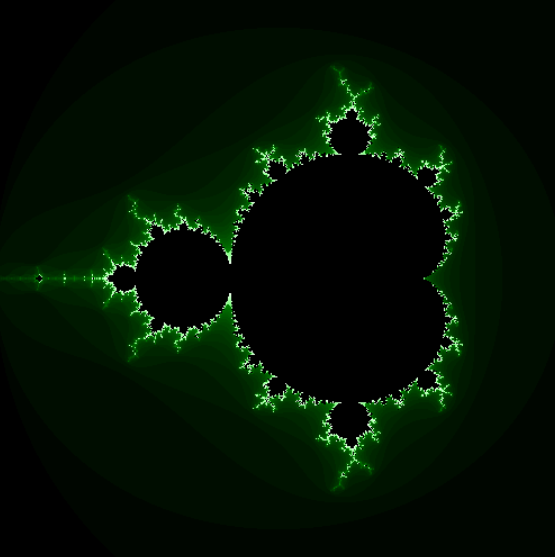

# Fractal Viewer

An interactive Mandelbrot set explorer rendered in real time on the GPU with **WebGPU**. Scroll to zoom in and out, anchored to your cursor.

<!-- TODO: add a live demo link once deployed, e.g. **[Live demo](https://your-site.example.com)** -->





## Features

- Real-time Mandelbrot rendering using a WebGPU fragment shader (WGSL)
- Smooth scroll-to-zoom centered on the cursor position
- Multiple color palettes (`blue`, `better_blue`, `green`)
- Configurable iteration strategies: fixed count, distance-based `auto`, or time-based ramp-up (`time_incremental`)
- Reusable `<FractalViewer />` React component with a small, typed props API

## Requirements

- [Node.js](https://nodejs.org/) 18+
- A browser with WebGPU support (recent Chrome or Edge; enable `chrome://flags/#enable-unsafe-webgpu` if needed)

## Getting started

```bash
# Clone
git clone https://github.com/nono-pio/FractalViewer
cd FractalViewer

# Install dependencies
npm install

# Start the dev server
npm run dev

# Type-check and build for production
npm run build

# Preview the production build locally
npm run preview
```

## Usage

Scroll up on the canvas to zoom in, scroll down to zoom out — the point under your cursor stays fixed while zooming.

The viewer is a standalone component you can configure through props:

```tsx
<FractalViewer
    width={400}
    height={400}
    iteration={'time_incremental'}
    time_per_iteration={0.01}
    color_mode={"green"}
/>
```

| Prop                 | Type                                     | Default                        | Description                                                           |
|----------------------|------------------------------------------|--------------------------------|-----------------------------------------------------------------------|
| `width`              | `number \| string`                       | `400`                          | Canvas width                                                          |
| `height`             | `number \| string`                       | `400`                          | Canvas height                                                         |
| `iteration`          | `number \| 'auto' \| 'time_incremental'` | `'auto'`                       | Max iteration strategy (fixed, distance-based, or time-based ramp-up) |
| `default_view`       | `{ pos_x, pos_y, width, height }`        | centered on the Mandelbrot set | Initial viewport in fractal coordinates                               |
| `scale_factor`       | `number` (between 0 and 1)               | `0.8`                          | Zoom factor applied per scroll step                                   |
| `time_per_iteration` | `number`                                 | `0.2`                          | Seconds per extra iteration when `iteration` is `'time_incremental'`  |
| `color_mode`         | `'blue' \| 'better_blue' \| 'green'`     | `'better_blue'`                | Color palette used to render the set                                  |

## Project structure

```
src/
├── main.tsx            # App entry point, mounts <FractalViewer />
└── FractalViewer.tsx    # WebGPU setup, WGSL shader, and React component
```

## To Add

- [ ] Configurable background color
- [ ] Better gradients / custom color picker
- [ ] Improved `auto` iteration mode
- [ ] Bug fixes / stability pass
- [ ] Live demo

## Gifs


  
  
 


## References

- [Mandelbrot set — Wikipedia](https://en.wikipedia.org/wiki/Mandelbrot_set)
- [Smooth coloring algorithm](https://stackoverflow.com/a/16505538)
- [Escape time optimization](https://stackoverflow.com/a/25816111)

## License

Distributed under the [MIT License](LICENSE).

